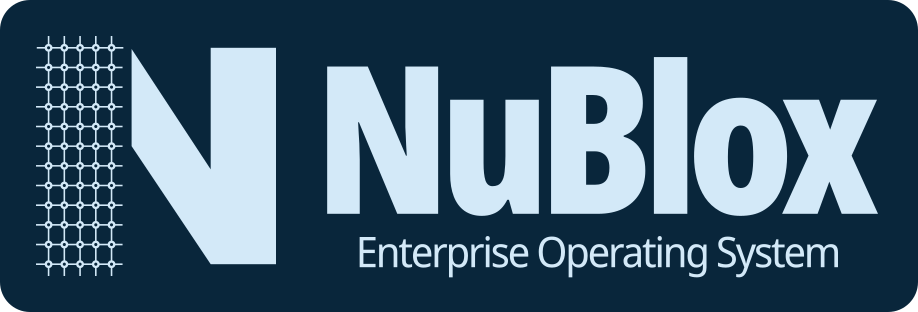

# NuBlox Enterprise Operating System

NuBlox is an enterprise operating system being defined and developed through a controlled software-development programme.

## Programme approach

The programme proceeds top-down from business intent through product definition, market/customer evidence, requirements, architecture, design, implementation, verification, release and operation.

The repository separates **document templates** from **live controlled programme documents**:

- [`software_project_docs_templates/`](software_project_docs_templates/) — reusable project-document templates;
- [`software_project_docs/`](software_project_docs/) — live NuBlox controlled documents and current programme decisions/evidence.

## Project document templates

The template library spans:

- enterprise and pre-project work;
- legal, commercial and procurement;
- product, market and UX;
- project initiation;
- planning and governance;
- requirements and analysis;
- architecture and design;
- development and implementation;
- testing and quality assurance;
- deployment and release;
- operations and maintenance;
- project closure;
- cross-cutting project controls.

The common document-control metadata requirements are defined in:

[`software_project_docs_templates/00_Templates/Document_Control_Metadata_Template.md`](software_project_docs_templates/00_Templates/Document_Control_Metadata_Template.md)

Template files are reference structures. NuBlox decisions and evidence belong in the corresponding live document under `software_project_docs/`.

## Current controlled documents

The live programme index is:

[`software_project_docs/README.md`](software_project_docs/README.md)

The first Enterprise / Pre-Project baseline now includes controlled Draft v0.1 documents for:

- Product vision statement;
- Product strategy;
- Market analysis;
- Competitor analysis;
- Customer research summary;
- Business case;
- Feasibility study.

These drafts establish hypotheses and evidence requirements; they are not approved product or architecture baselines yet.

## Brand assets

Canonical NuBlox brand assets are maintained under:

[`brand/`](brand/)

For light-background usage, the primary logo asset is:

[`brand/NuBlox_Logo_On_Light_Background.svg`](brand/NuBlox_Logo_On_Light_Background.svg)

Brand assets should be referenced from this directory rather than duplicated into project-document or application folders.

## Working principles

- Define the business and product need before defining the software solution.
- Maintain traceability from strategy through requirements, architecture, implementation, testing, release and operation.
- Use the repository templates as the default structure for controlled project documents.
- Keep hypotheses visibly separate from approved decisions.
- Record important assumptions, risks, evidence, approvals and changes.
- Prefer complete business outcomes over feature lists or module boundaries.
- Avoid creating overlapping documents when one controlled artifact can satisfy the requirement clearly.
- Keep implementation decisions subordinate to approved business, product and technical requirements.

## Current phase

The programme is in **Enterprise / Pre-Project definition and validation**.

The immediate work is to strengthen the Draft product/market case through customer evidence, cost/benefit analysis, financial modelling, risk/compliance work and enterprise-architecture principles before progressing into controlled requirements and software architecture.

## Licence

Proprietary. See [`LICENSE`](LICENSE).
