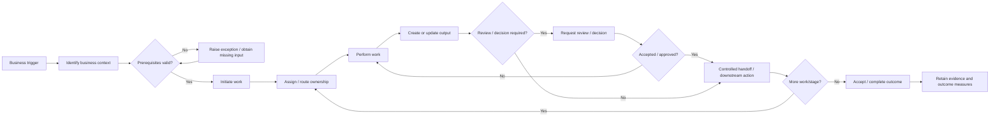
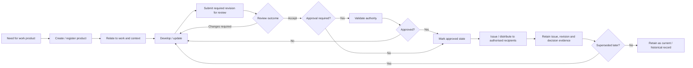
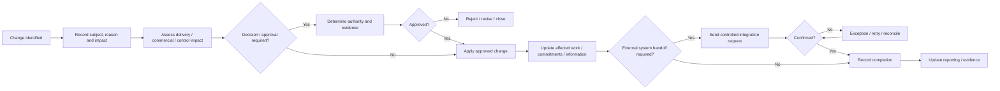
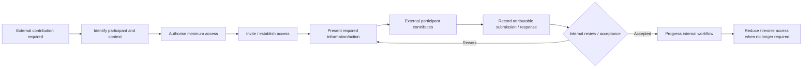
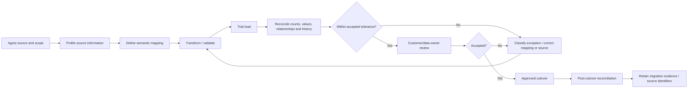

# Process maps

**Section:** F_Requirements_Analysis  
**Document ID:** NBEOS-F-023  
**Document Type:** Process maps  
**Version:** 0.1  
**Status:** Draft  
**Author / Owner:** NuBlox Product / Business Analysis  
**Reviewer:** [TBD]  
**Approver:** [TBD]  
**Approval Date:** [TBD]  
**Effective Date:** [TBD]  
**Review Date:** [TBD]  
**Expiry Date:** [TBD]  
**Classification:** Internal  
**Retention Period:** [TBD]  
**Disposal Method:** [TBD]  
**Distribution List:** NuBlox programme contributors  
**Related Documents:** `Use_cases.md`, `User_journeys.md`, `Business_rules.md`, `BPMN_diagrams.md`  
**Supersedes:** None  
**Superseded By:** None  
**Template Used:** `software_project_docs_templates/F_Requirements_Analysis/Process_maps.md`  
**Storage Location:** `software_project_docs/F_Requirements_Analysis/Process_maps.md`  
**Access Permissions:** Repository access controls  
**Digital Signature:** Not yet signed  
**Audit Trail:** Git history  

## Purpose

Record conceptual candidate process maps derived from the current requirements so end-to-end continuity, decisions, handoffs, information and exceptions can be reviewed before formal BPMN and solution design.

These maps are **not approved operating procedures and not formal BPMN 2.0 models**.

## PM-001 — From business trigger to completed work

**Key requirements:** `BR-001`, `BR-002`, `BR-005`, `BR-007`, `FR-009`–`FR-018`.

## PM-002 — Governed work-product lifecycle

**Key requirements:** `FR-019`–`FR-022`, `RULE-003`, `RULE-006`, `BR-014`.

## PM-003 — Controlled business change

**Key requirements:** `FR-018`, `FR-023`–`FR-025`, `INT-004`–`INT-007`, `AC-007`.

## PM-004 — External collaboration

**Key requirements:** `FR-004`, `RULE-008`, `NFR-SEC-001`, `SR-031`, `SR-032`.

## PM-005 — Migration and reconciliation

**Key requirements:** `DATA-009`, `DATA-010`, `AC-008`, `BR-013`.

## Process-map review checklist

For each process map, validation must identify:

- actual actor(s) and ownership;
- triggers and completion conditions;
- required information and authoritative sources;
- work products/transactions/records;
- decisions/authority rules;
- handoffs and external parties;
- exceptions/cancellation/recovery;
- timing/deadline obligations;
- reporting/measure consequences;
- applicable NFR/security/privacy constraints;
- customer/discipline variations.

## References

- `Use_cases.md`
- `User_journeys.md`
- `Business_rules.md`

## Change History

| Version | Date | Author | Description |
|---|---|---|---|
| 0.1 | 2026-09-26 | NuBlox Product / Business Analysis | Initial five conceptual process maps derived from controlled requirements |