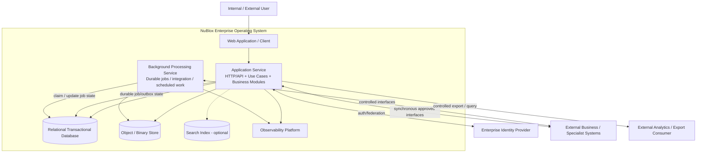

# Container diagram

**Section:** G_Architecture_Design  
**Document ID:** NBEOS-G-007  
**Document Type:** Container diagram  
**Version:** 0.1  
**Status:** Draft  
**Author / Owner:** NuBlox Architecture  
**Reviewer:** [TBD]  
**Approver:** [TBD]  
**Approval Date:** [TBD]  
**Effective Date:** [TBD]  
**Review Date:** [TBD]  
**Expiry Date:** [TBD]  
**Classification:** Internal  
**Retention Period:** [TBD]  
**Disposal Method:** [TBD]  
**Distribution List:** NuBlox programme contributors  
**Related Documents:** `System_context_diagram.md`, `High-level_design_HLD.md`, `Solution_architecture_document.md`  
**Supersedes:** None  
**Superseded By:** None  
**Template Used:** `software_project_docs_templates/G_Architecture_Design/Container_diagram.md`  
**Storage Location:** `software_project_docs/G_Architecture_Design/Container_diagram.md`  
**Access Permissions:** Repository access controls  
**Digital Signature:** Not yet signed  
**Audit Trail:** Git history  

## Purpose

Provide a C4-style Draft container view of the leading solution architecture hypothesis. A container here is an independently runnable/store responsibility, not necessarily a microservice.

## Candidate container view

## Candidate containers

| Container | Responsibility | Authority |
|---|---|---|
| Web Application / Client | User interaction and presentation | Never authoritative for business rules/state |
| Application Service | Server-side use cases, business rules, access/authority, transactions, APIs | Authoritative behaviour for in-scope NuBlox business state |
| Background Processing Service | Retryable/long-running/scheduled/integration work | Operates through controlled application/domain contracts and durable state |
| Relational Transactional Database | Authoritative structured state, history, config, audit references, durable work state | Primary structured persistence hypothesis |
| Object / Binary Store | Binary content when stored by NuBlox | Content authority depends on workflow; metadata governed transactionally |
| Search Index | Derived search representation if required | Never primary business authority |
| Observability Platform | Technical logs/metrics/traces/alerts | Operational evidence; not automatically business audit authority |

## Deployment hypothesis

Initial deployment may package the Application Service and Background Processing code from one repository/codebase while running one or more separate processes. Scale-out can occur independently if measured workload justifies it.

This does not prevent future extraction of modules into services when a demonstrated boundary/operational need exists.

## Trust boundaries

Material trust boundaries include:

- browser/user to server;
- standard participant to privileged administration;
- customer/isolation boundary (implementation TBD);
- NuBlox to external IdP;
- NuBlox to external systems/services;
- application runtime to persistent stores;
- production to observability/support access;
- production to analytics/export destinations.

## Open questions

- Is a separate API gateway required or unnecessary for initial architecture?
- Is server-side rendering/BFF architecture needed for UX/security/performance?
- Which workload requires a dedicated worker from first release?
- Which binary content belongs in NuBlox vs specialist repositories?
- Is dedicated search required initially?
- How is customer isolation applied to every container/store?
- Which telemetry data may contain customer/sensitive information?

## References

- `System_context_diagram.md`
- `High-level_design_HLD.md`
- `Solution_architecture_document.md`

## Change History

| Version | Date | Author | Description |
|---|---|---|---|
| 0.1 | 2026-09-26 | NuBlox Architecture | Initial candidate container view for cohesive modular solution |