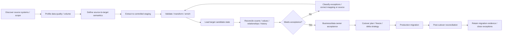

# Data migration design

**Section:** G_Architecture_Design  
**Document ID:** NBEOS-G-011  
**Document Type:** Data migration design  
**Version:** 0.1  
**Status:** Draft  
**Author / Owner:** NuBlox Architecture / Data / Delivery  
**Reviewer:** [TBD]  
**Approver:** [TBD]  
**Approval Date:** [TBD]  
**Effective Date:** [TBD]  
**Review Date:** [TBD]  
**Expiry Date:** [TBD]  
**Classification:** Internal  
**Retention Period:** [TBD]  
**Disposal Method:** [TBD]  
**Distribution List:** NuBlox programme contributors  
**Related Documents:** `Data_architecture.md`, `Solution_architecture_document.md`, `../F_Requirements_Analysis/Data_requirements.md`, `../F_Requirements_Analysis/Acceptance_criteria.md`  
**Supersedes:** None  
**Superseded By:** None  
**Template Used:** `software_project_docs_templates/G_Architecture_Design/Data_migration_design.md`  
**Storage Location:** `software_project_docs/G_Architecture_Design/Data_migration_design.md`  
**Access Permissions:** Repository access controls  
**Digital Signature:** Not yet signed  
**Audit Trail:** Git history  

## Purpose

Define a repeatable migration architecture for bringing customer information into NuBlox while preserving semantic meaning, provenance, history and reconciliation evidence.

## Migration principle

Migration is not a one-off import script. It is a controlled product/delivery capability with explicit source profiling, mapping, validation, exception handling, reconciliation, cutover and retained evidence.

## Migration lifecycle

## Migration architecture responsibilities

### Source connector / extractor
- extracts supported source data without altering source;
- captures source system/version/extract timestamp;
- preserves source identifiers;
- supports incremental/delta extraction where required.

### Staging area
- isolated from authoritative production state;
- stores raw/extracted data and metadata for profiling/mapping;
- access restricted due to potentially sensitive/uncontrolled source data;
- retention/disposal controlled after migration.

### Profiling / quality analysis
Measures source completeness, duplicates, invalid references, code distributions, date ranges, volumes and known integrity issues before mapping is approved.

### Mapping / transformation definitions
Should be versioned and reviewable. Mapping captures:
- source field/concept;
- target business concept;
- transformation/default/lookup;
- loss/ambiguity decision;
- owner/approval;
- version/effective migration wave.

### Validation engine / rules
Applies structural and business validation before target state is accepted.

### Loader
Writes through a controlled bulk/migration application boundary capable of preserving required invariants while supporting high-volume operation. Direct raw table inserts should not be the default migration contract.

### Reconciliation
Compares source/staging/target using agreed controls and retains result evidence.

## Migration identity strategy

For migrated records retain, where applicable:

- NuBlox internal ID;
- source system ID/type;
- source record ID/business key;
- source extraction/migration batch;
- original source version/effective information;
- transformation/mapping version.

External/source IDs are not assumed globally unique.

## History migration

For each business concept decide deliberately whether to migrate:

- current state only;
- active/open records;
- defined historical period;
- full retained history;
- documents/binary artifacts;
- audit/event history;
- only summary/opening balances.

The choice depends on user need, legal/contractual retention, audit requirements, migration cost, source quality and target semantics.

## Document/file migration

Where binary content is migrated:

- preserve source identity/path/reference;
- calculate checksum/hash where appropriate;
- map content to target business context;
- retain revision/version metadata where required;
- validate file existence/size/type;
- scan/security-check according to policy;
- distinguish missing/corrupt content as migration exceptions.

## Reference/code migration

Source statuses/codes/classifications may not map one-to-one. Mapping must record semantic decisions; unknown/unmappable values must not silently coerce into misleading target states.

## Cutover patterns

Candidate approaches:

### Big-bang cutover
Single migration/freeze/switch. Suitable only where scope and downtime/risk are acceptable.

### Phased/domain cutover
Migrate areas/workflows in waves with defined cross-system transition boundaries.

### Parallel / coexistence transition
Source remains active for some capability while NuBlox becomes authoritative elsewhere; requires explicit synchronisation/source-authority controls.

### Incremental + final delta
Bulk baseline followed by changed-record delta during final cutover.

No pattern is selected until a real source/customer implementation is known.

## Reconciliation model

Migration acceptance may include:

- source/target record counts by class/state;
- sums/control totals for amounts/quantities;
- uniqueness/key checks;
- required relationship completeness;
- orphan detection;
- effective-date/history continuity;
- file counts/checksums;
- sampling/business-owner review;
- known exception register;
- report/business outcome comparison.

Tolerance must be explicitly approved; `100%` should not be invented where source quality makes it impossible, but unexplained discrepancy is never acceptance.

## Exception management

Every migration exception should record:

- batch/source/context;
- record/business identity;
- rule/failure category;
- source data evidence;
- disposition: correct source / transform / accepted exception / exclude / manual controlled action;
- owner;
- resolution evidence.

## Migration security/privacy

- staging may contain broad sensitive data and needs restrictive access;
- avoid production data in development/test unless approved and protected;
- use masked/synthetic data where possible;
- encrypt migration files/transfers;
- retain migration credentials securely;
- dispose of temporary extracts according to policy;
- preserve legal/retention holds where applicable;
- audit privileged migration execution.

## Repeatability and automation

Migration pipelines should be rerunnable/idempotent by batch or use deterministic replacement/upsert semantics. Trial migration should use the same controlled code path as production wherever practical.

Configuration/mappings should be versioned and promotable across environments rather than manually recreated.

## Migration performance

Before customer cutover, test using representative volumes for:

- extraction throughput;
- transformation throughput;
- load throughput;
- index/constraint impact;
- reconciliation duration;
- file/content transfer;
- final delta window;
- backup/rollback time.

No performance target is invented before source volumes/cutover constraints are known.

## Rollback / recovery

Cutover plans must define:

- point of no return;
- target backup/snapshot strategy;
- source freeze/unfreeze rules;
- integration enable/disable sequence;
- failed batch cleanup semantics;
- business transaction handling during cutover;
- forward-fix vs restore decision criteria.

## Product migration capability hypothesis

NuBlox should eventually include reusable migration tooling/services for:

- source connector framework;
- staging;
- profiling;
- mapping definitions;
- validation;
- batch loading;
- reconciliation;
- exception management;
- audit/evidence.

Whether this is user-facing product functionality, implementation tooling or both remains an architecture/product decision.

## Initial migration spike

Create a representative synthetic/controlled source dataset containing:

- stable master records;
- relationships;
- effective-dated history;
- work records;
- decisions/evidence;
- external IDs;
- duplicate/invalid/orphan examples;
- binary attachments;
- source status codes requiring mapping.

Prove deterministic import, error classification, rerun and reconciliation before customer implementation.

## Open decisions

- staging technology;
- mapping definition format/tooling;
- migration API/bulk loader design;
- source connector architecture;
- batch orchestration technology;
- customer-specific mapping packaging;
- temporary-data retention;
- cutover support tooling/UI;
- migration evidence/report format.

## References

- `Data_architecture.md`
- `../F_Requirements_Analysis/Data_requirements.md`
- `../F_Requirements_Analysis/Acceptance_criteria.md`
- `Architecture_decision_records_ADRs.md`

## Change History

| Version | Date | Author | Description |
|---|---|---|---|
| 0.1 | 2026-09-26 | NuBlox Architecture / Data / Delivery | Initial repeatable migration, staging, mapping, reconciliation and cutover architecture |