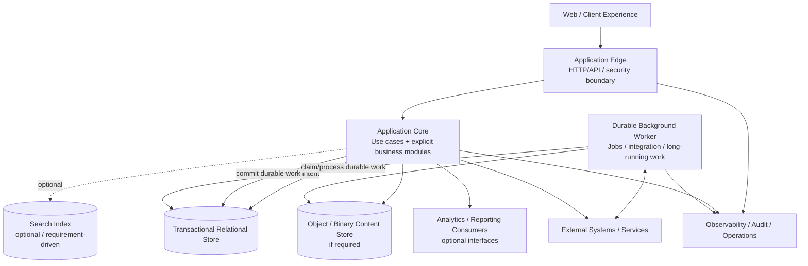

# High-level design (HLD)

**Section:** G_Architecture_Design  
**Document ID:** NBEOS-G-006  
**Document Type:** High-level design (HLD)  
**Version:** 0.1  
**Status:** Draft  
**Author / Owner:** NuBlox Architecture  
**Reviewer:** [TBD]  
**Approver:** [TBD]  
**Approval Date:** [TBD]  
**Effective Date:** [TBD]  
**Review Date:** [TBD]  
**Expiry Date:** [TBD]  
**Classification:** Internal  
**Retention Period:** [TBD]  
**Disposal Method:** [TBD]  
**Distribution List:** NuBlox programme contributors  
**Related Documents:** `Solution_architecture_document.md`, `Container_diagram.md`, `Architecture_decision_records_ADRs.md`, `../F_Requirements_Analysis/README.md`  
**Supersedes:** None  
**Superseded By:** None  
**Template Used:** `software_project_docs_templates/G_Architecture_Design/High-level_design_HLD.md`  
**Storage Location:** `software_project_docs/G_Architecture_Design/High-level_design_HLD.md`  
**Access Permissions:** Repository access controls  
**Digital Signature:** Not yet signed  
**Audit Trail:** Git history  

## Purpose

Translate the provisional solution architecture into high-level software responsibilities and runtime interactions suitable for technical spikes and later component design. Technology products remain intentionally unselected.

## Draft runtime responsibility view



The diagram shows responsibility, not selected deployment count or technology.

## Candidate high-level containers/responsibilities

### Client / Experience

Responsibilities:
- work-centred user interaction;
- permitted external collaboration experience;
- input validation for usability only (server remains authoritative);
- accessible/responsive interaction;
- no direct database access.

### Application Edge

Responsibilities:
- HTTP/API termination/routing as applicable;
- authentication/session boundary;
- request correlation;
- cross-cutting input/security controls;
- entry into application use cases.

The Edge may be part of the same deployable application as the Core initially.

### Application Core

Responsibilities:
- application use-case orchestration;
- explicit business/domain rules;
- authority/access enforcement beyond edge authentication;
- transactional business state changes;
- business event/audit generation;
- configuration evaluation;
- creation of durable asynchronous work intent.

### Background Worker

Responsibilities:
- long-running or retryable processing;
- integration delivery/recovery;
- notifications;
- scheduled/batch work;
- heavy document/data processing where applicable;
- asynchronous projections/index updates where later required.

It may share code/modules with the Core while running as a separate process/runtime for operational isolation.

### Transactional Relational Store

Candidate responsibilities:
- authoritative structured business state managed by NuBlox;
- transactional integrity;
- relationships/constraints;
- history/effective-state structures;
- durable async work/outbox state where chosen;
- migration/reconciliation records;
- controlled configuration state.

### Object / Binary Store

Candidate responsibilities:
- binary documents/work-product files/assets where NuBlox owns storage;
- immutable/versioned objects where required;
- content checksums/metadata linked to transactional business state.

### Search Index — Optional

Introduced only if validated requirements cannot be met adequately by the primary data store. It is a derived/search representation, not authoritative business truth.

### External Systems / Services

Integrated through explicit adapters/contracts. The Core/Worker must preserve source authority, correlation, failure state and reconciliation.

### Observability / Audit

Technical observability and business audit/evidence are related but distinct. Technical logs must not be treated as the sole business audit trail where durable governed evidence is required.

## Internal module strategy — Candidate

The application core should use explicit responsibility modules. Candidate high-level concern groups include:

- identity/context/access;
- business parties/relationships once semantics are validated;
- work coordination;
- decisions/authority/evidence;
- work products/records;
- commercial/delivery context for selected workflows;
- integration;
- reporting/query;
- configuration;
- audit/history.

These labels are placeholders for design exploration, not frozen bounded contexts.

## Dependency principles

- UI/transport code depends inward on application contracts, not vice versa.
- Business/domain logic must not depend directly on vendor SDKs/framework-specific persistence APIs where avoidable.
- Integration adapters implement contracts owned by application/domain needs.
- Cross-module database writes should be controlled through module/application APIs rather than arbitrary table access.
- Derived search/reporting representations must not become accidental write authorities.
- Background processing must be safe under retry/restart.

## Representative transaction pattern

For a business operation requiring a durable external consequence:

```text
request
→ authenticate/authorise
→ validate business rule/authority
→ transactional state change
→ record audit/business event
→ record durable outbox/job intent in same commit
→ return committed business result
→ worker later processes external effect
→ record acknowledgement/result/retry/reconciliation
```

This is a candidate pattern to be validated by `ADR-003`.

## Failure design principles

- no silent business-data loss;
- no normal recovery through direct production DB edits;
- explicit incomplete/failed external outcomes;
- idempotent/replay-safe processing where retries occur;
- user-visible exception state where business action is required;
- diagnostic correlation from business request through background/integration processing.

## HLD decisions still open

- exact internal module boundaries;
- database-per-customer/shared isolation topology;
- language/runtime/framework;
- primary database technology;
- worker/job/messaging implementation;
- object storage provider/format policies;
- search need/technology;
- real-time communication requirements;
- caching strategy;
- reporting/analytics deployment;
- cloud/runtime topology.

## References

- `Solution_architecture_document.md`
- `Container_diagram.md`
- `Architecture_decision_records_ADRs.md`
- `../F_Requirements_Analysis/README.md`

## Change History

| Version | Date | Author | Description |
|---|---|---|---|
| 0.1 | 2026-09-26 | NuBlox Architecture | Initial high-level runtime responsibility and transaction design |