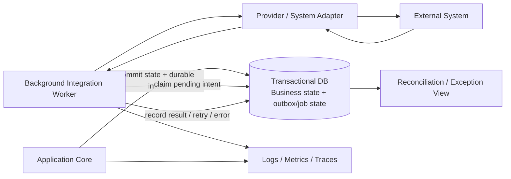

# Integration design

**Section:** G_Architecture_Design  
**Document ID:** NBEOS-G-009  
**Document Type:** Integration design  
**Version:** 0.1  
**Status:** Draft  
**Author / Owner:** NuBlox Architecture / Integration  
**Reviewer:** [TBD]  
**Approver:** [TBD]  
**Approval Date:** [TBD]  
**Effective Date:** [TBD]  
**Review Date:** [TBD]  
**Expiry Date:** [TBD]  
**Classification:** Internal  
**Retention Period:** [TBD]  
**Disposal Method:** [TBD]  
**Distribution List:** NuBlox programme contributors  
**Related Documents:** `Solution_architecture_document.md`, `High-level_design_HLD.md`, `../F_Requirements_Analysis/Interface_requirements.md`, `../F_Requirements_Analysis/Integration_requirements.md`, `../F_Requirements_Analysis/API_requirements.md`  
**Supersedes:** None  
**Superseded By:** None  
**Template Used:** `software_project_docs_templates/G_Architecture_Design/Integration_design.md`  
**Storage Location:** `software_project_docs/G_Architecture_Design/Integration_design.md`  
**Access Permissions:** Repository access controls  
**Digital Signature:** Not yet signed  
**Audit Trail:** Git history  

## Purpose

Define the first technical integration architecture for NuBlox, translating controlled interface/integration requirements into reliable adapter, delivery, recovery and reconciliation patterns without selecting vendor-specific protocols prematurely.

## Integration architecture goals

- preserve business authority and meaning across systems;
- isolate vendor/provider specifics from core business logic;
- guarantee durable intent for material outbound effects;
- make partial/failure states explicit;
- enable safe retries/idempotency;
- support reconciliation and controlled human recovery;
- protect sensitive data and credentials;
- version external contracts deliberately;
- provide business and technical observability.

## Logical integration model



## Integration boundary pattern

Core business/application logic should depend on an interface/port describing the needed business capability, for example:

```text
Application need
→ integration port/contract owned by NuBlox
→ provider adapter
→ provider-specific API/file/event implementation
```

This allows vendor/provider substitution and testing without leaking provider concepts throughout domain code.

## Interaction patterns

### Synchronous request/response

Use when the user/business operation requires an immediate answer and the dependency latency/reliability is acceptable.

Controls:
- timeout/circuit behaviour;
- clear failure semantics;
- correlation;
- no local transaction held open across an unreliable dependency unless explicitly justified;
- fallback/degraded behaviour where possible.

### Durable asynchronous command/job

Use when the external effect can occur after local commit or requires reliable retry.

Pattern:

```text
local transaction commits business state + integration intent
→ worker delivers
→ result/acknowledgement recorded
→ retry/backoff or exception/reconciliation
```

### Inbound event/webhook

Use where provider supports event delivery and freshness/value justify it.

Controls:
- source authenticity;
- replay/duplicate handling;
- ordering assumptions explicit;
- correlation to customer/business context;
- validation before business state change;
- dead-letter/exception handling.

### Scheduled/batch/file

Use when source capabilities/volume/business timing warrant it.

Controls:
- file/job identity;
- checksum/control totals;
- staging/validation;
- partial failure handling;
- reconciliation and rerun semantics.

### Bulk migration/import/export

Use separate controlled migration/bulk paths rather than forcing high-volume historical loads through ordinary interactive APIs when that would be inefficient or unsafe.

## Durable intent / outbox hypothesis

For material external effects following a local business transaction, use a pattern in which the business state change and durable integration intent are committed atomically in the same database transaction.

Candidate states:

```text
PENDING → PROCESSING → SUCCEEDED
                    ↘ RETRY_WAIT
                    ↘ FAILED_ACTION_REQUIRED
                    ↘ CANCELLED / SUPERSEDED
```

The exact state model will be designed after technology selection.

## Idempotency strategy

Where duplicate delivery can occur:

- generate stable operation/correlation ID;
- retain provider idempotency key if supported;
- detect already-completed operations before repeating side effects;
- ensure retries do not create duplicate commercial/decision/business results;
- distinguish repeated delivery from legitimate repeated business action.

## Inbound identity/correlation

External records/messages should be mapped using:

- customer/isolation context;
- source-system identity;
- external identifier;
- integration configuration/version;
- NuBlox internal business identifier where established.

Do not assume external identifiers are globally unique.

## Mapping strategy

Provider payload models should be transformed at the adapter boundary into controlled NuBlox contract/business representations.

Mapping must explicitly handle:

- states/status values;
- codes/classifications;
- dates/timezones;
- currency/units;
- identity references;
- optional/unknown values;
- precision;
- deleted/closed/superseded state;
- incompatible source semantics.

## Reconciliation

Material integrations require a reconciliation strategy appropriate to risk:

- request vs acknowledgement;
- record/count/value comparison;
- periodic source/target comparison;
- missed-event detection;
- orphan/duplicate detection;
- manual exception queue with accountable resolution.

## Security design

- credentials/secrets in dedicated secret management, not source code;
- service identities are least privilege;
- TLS/encryption appropriate to classification;
- inbound authenticity verified;
- outbound destination allow-list/configuration controlled;
- sensitive payload logging prohibited/minimised;
- customer/isolation context validated server side;
- credential rotation supported.

## Observability

Every material integration operation should support correlation through:

```text
business subject/work
→ NuBlox operation ID
→ integration job/message ID
→ provider request/response ID where available
```

Metrics should distinguish business success from HTTP/transport success.

Candidate metrics:
- pending backlog;
- success/failure rate;
- retry count;
- age of oldest pending item;
- latency to confirmed completion;
- reconciliation exceptions;
- provider availability/rate limiting.

## Provider configuration

Integration configuration should be governed data containing:

- provider/type;
- customer/isolation scope;
- endpoint/environment;
- credential reference;
- enabled operations;
- mapping/version;
- timeout/retry/rate controls;
- effective status;
- owner/support metadata.

Configuration shall not store raw secrets.

## Initial spike scenarios

1. Outbound commercial/financial handoff with retry and provider rejection.
2. Inbound specialist-system update with duplicate/replay handling.
3. Provider outage lasting longer than process lifetime.
4. Mapping change requiring backward-compatible transition.
5. Customer-specific integration configuration without source-code fork.
6. Reconciliation of intentionally ambiguous/failed source state.

## Open decisions

- job/message technology;
- broker vs database-backed durable queue;
- API protocol/style standards;
- webhook gateway/verification approach;
- file-transfer mechanism;
- provider adapter packaging/module boundaries;
- rate limiting/circuit-breaker implementation;
- event schema registry need;
- enterprise integration platform use vs native adapters.

## References

- `../F_Requirements_Analysis/Interface_requirements.md`
- `../F_Requirements_Analysis/Integration_requirements.md`
- `../F_Requirements_Analysis/API_requirements.md`
- `Solution_architecture_document.md`
- `Architecture_decision_records_ADRs.md`

## Change History

| Version | Date | Author | Description |
|---|---|---|---|
| 0.1 | 2026-09-26 | NuBlox Architecture / Integration | Initial adapter, durable-delivery, recovery and reconciliation design |