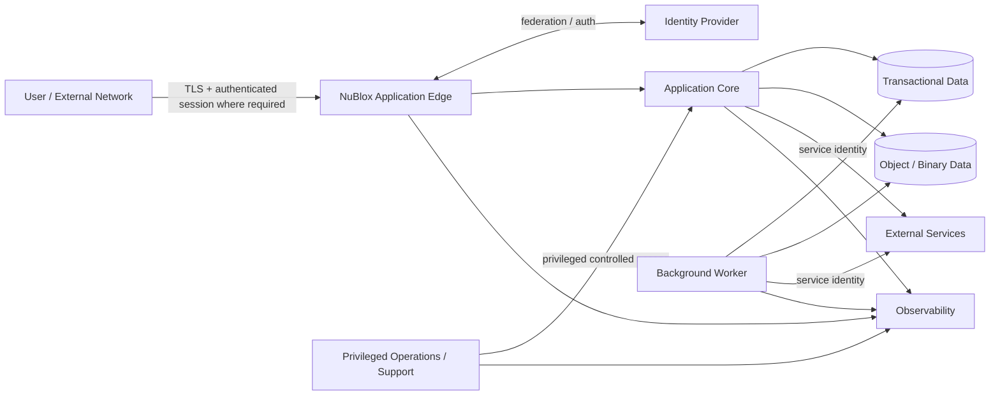

# Security architecture

**Section:** G_Architecture_Design  
**Document ID:** NBEOS-G-010  
**Document Type:** Security architecture  
**Version:** 0.1  
**Status:** Draft  
**Author / Owner:** NuBlox Architecture / Security  
**Reviewer:** [TBD]  
**Approver:** [TBD]  
**Approval Date:** [TBD]  
**Effective Date:** [TBD]  
**Review Date:** [TBD]  
**Expiry Date:** [TBD]  
**Classification:** Internal  
**Retention Period:** [TBD]  
**Disposal Method:** [TBD]  
**Distribution List:** NuBlox programme contributors  
**Related Documents:** `Solution_architecture_document.md`, `System_context_diagram.md`, `../F_Requirements_Analysis/Non-functional_requirements_specification.md`, `../A_Enterprise_Pre_Project/Security_classification_policy.md`  
**Supersedes:** None  
**Superseded By:** None  
**Template Used:** `software_project_docs_templates/G_Architecture_Design/Security_architecture.md`  
**Storage Location:** `software_project_docs/G_Architecture_Design/Security_architecture.md`  
**Access Permissions:** Repository access controls  
**Digital Signature:** Not yet signed  
**Audit Trail:** Git history  

## Purpose

Define the initial security architecture for NuBlox from the controlled security/privacy/access/audit requirements. Detailed threat modelling, IAM design and privacy assessment are separate follow-on artifacts.

## Security objectives

- authenticate users/services strongly enough for the selected market/risk;
- enforce least-privilege access server side;
- enforce business authority separately where required;
- prevent cross-customer/cross-context data leakage;
- protect sensitive information in transit, at rest and in operational tooling;
- make privileged actions/configuration attributable;
- preserve required business/security audit evidence;
- minimise secrets and personal data exposure;
- support investigation, recovery and controlled administration;
- secure software supply chain, deployment and runtime.

## Security trust model — Draft



Every arrow represents a trust boundary/permission decision to be designed and tested; the diagram is not a network topology.

## Identity architecture

### Human identity

Candidate direction:
- support enterprise identity federation where appropriate;
- avoid local password identity as the only enterprise model;
- maintain a NuBlox application identity/profile linked to authenticated identity rather than assuming external identity attributes equal business authority;
- require reauthentication/step-up for sensitive operations where risk warrants it.

### Service identity

Machine-to-machine operations use dedicated service identities, not shared human accounts. Scope credentials to the minimum integration/customer/environment purpose.

### Privileged identity

Administrative/platform privileges require stronger controls, attribution and separation from ordinary user activity. Break-glass access, if later required, must be exceptional, monitored and reviewed.

## Access control model — Requirements

Access decisions may depend on:

- authenticated identity;
- customer/organisation/isolation context;
- participant relationship;
- business/work context;
- information classification;
- explicit permission/role/policy;
- ownership/responsibility where approved;
- business authority conditions;
- record/lifecycle state;
- time/delegation/effective conditions;
- segregation-of-duties constraints.

The final model (RBAC, ABAC, relationship-based, hybrid) remains an ADR/spike decision.

## Permission vs business authority

Security architecture shall preserve the requirement that:

```text
technical permission to invoke operation
≠
business authority to approve / commit / decide
```

A sensitive decision may require both access permission and validated business authority in the specific context.

## Customer/isolation security

`ADR-007` is a critical security decision. Regardless of database topology, every request/background job/integration must carry an unambiguous customer/isolation context where data is segregated.

Required protections include:
- no client-supplied customer identifier trusted without server-side validation;
- data access constrained by authenticated context;
- background jobs retain immutable isolation context;
- cache/search/reporting/object-store paths preserve isolation;
- support tooling cannot accidentally cross context;
- automated tests explicitly attempt cross-context access.

## Data protection

- encryption in transit using approved modern TLS;
- encryption at rest appropriate to provider/data classification;
- keys/secrets separated from application source/config where possible;
- sensitive fields excluded/minimised from logs and telemetry;
- backups/export files protected to equal classification;
- retention/disposal propagated to replicas/derived stores according to policy.

Exact cryptographic/provider standards require later security standards/ADR.

## Secrets management

Secrets include integration credentials, database credentials, signing keys, API keys and privileged tokens.

Requirements:
- never commit secrets to source control;
- use managed secret storage or equivalent protected mechanism;
- environment-specific values separated;
- access audited;
- rotation supported;
- short-lived/workload identity preferred where feasible;
- secret exposure response documented.

## Application security controls

- server-side input validation;
- output encoding/context-safe rendering;
- CSRF protection where cookie/session architecture requires it;
- secure session management;
- rate/abuse controls on exposed sensitive endpoints;
- object-level authorisation on every protected resource/action;
- safe file upload/content handling where supported;
- dependency/vulnerability management;
- security headers/content policies appropriate to chosen web stack;
- safe error handling without sensitive disclosure.

## API/integration security

- authenticate/authorise caller/service;
- validate customer/isolation context;
- verify webhook/inbound event authenticity;
- replay/idempotency controls;
- payload minimisation;
- encrypted transport;
- rate/abuse protection where public/external;
- scoped credentials and controlled destination configuration;
- integration/audit correlation without logging secrets.

## Audit/evidence security

Business/security audit requiring evidential integrity should be:

- attributable;
- reliably time-ordered;
- protected from ordinary user modification/deletion;
- accessible only to authorised users/services;
- retained according to policy;
- exportable for investigation under controlled conditions.

Technical application logs alone are not sufficient for business approval/decision evidence.

## Secure operations

- production/admin access least privilege;
- environment separation;
- deployment identity separate from application/user identity;
- infrastructure changes version controlled where possible;
- no normal production support through arbitrary DB mutation;
- security-sensitive configuration changes audited;
- vulnerability patching/dependency response process;
- backup/recovery security maintained;
- incident evidence protected.

## Software supply-chain security

The development/release architecture should provide:

- protected source repository/branch controls;
- reviewed changes;
- dependency lock/inventory;
- automated vulnerability/secret scanning as appropriate;
- reproducible/controlled builds;
- provenance of release artifacts;
- controlled CI/CD credentials;
- separation/approval for production deployment;
- software bill of materials before enterprise production release.

## Initial security test scenarios

1. Cross-customer record access by guessed/modified identifier.
2. User with permission but insufficient business authority attempts approval.
3. External collaborator attempts broader internal navigation/API access.
4. Background integration job executes with incorrect/missing customer context.
5. Privileged configuration change without audit attribution.
6. Stolen/replayed webhook request.
7. Sensitive data accidentally emitted to logs/error messages.
8. File upload containing unsafe content/type/size.
9. Expired/revoked external/session/service credential.
10. Restore/export operation bypassing ordinary access controls.

## Open security decisions

- customer isolation implementation;
- IdP/federation protocols/provider support;
- session/token architecture;
- RBAC/ABAC/relationship-policy hybrid;
- business authority/delegation design;
- key/secrets provider;
- privileged support-access design;
- audit tamper-protection mechanism;
- encryption/key hierarchy;
- security monitoring/SIEM integration;
- public/external collaboration authentication model.

## References

- `../F_Requirements_Analysis/Non-functional_requirements_specification.md`
- `../F_Requirements_Analysis/Business_rules.md`
- `../A_Enterprise_Pre_Project/Security_classification_policy.md`
- `System_context_diagram.md`
- `Architecture_decision_records_ADRs.md`

## Change History

| Version | Date | Author | Description |
|---|---|---|---|
| 0.1 | 2026-09-26 | NuBlox Architecture / Security | Initial identity, isolation, access, secrets, audit and secure-operations architecture |