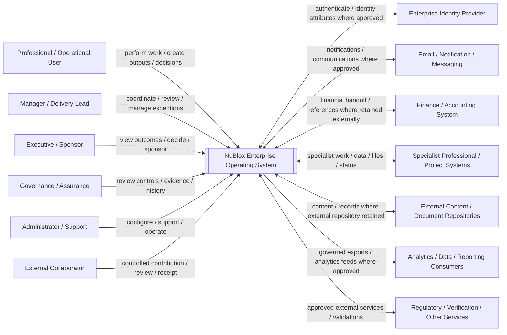

# System context diagram

**Section:** G_Architecture_Design  
**Document ID:** NBEOS-G-003  
**Document Type:** System context diagram  
**Version:** 0.1  
**Status:** Draft  
**Author / Owner:** NuBlox Architecture / Product  
**Reviewer:** [TBD]  
**Approver:** [TBD]  
**Approval Date:** [TBD]  
**Effective Date:** [TBD]  
**Review Date:** [TBD]  
**Expiry Date:** [TBD]  
**Classification:** Internal  
**Retention Period:** [TBD]  
**Disposal Method:** [TBD]  
**Distribution List:** NuBlox programme contributors  
**Related Documents:** `Architecture_vision.md`, `Architecture_definition.md`, `Solution_architecture_document.md`, `../F_Requirements_Analysis/Interface_requirements.md`  
**Supersedes:** None  
**Superseded By:** None  
**Template Used:** `software_project_docs_templates/G_Architecture_Design/System_context_diagram.md`  
**Storage Location:** `software_project_docs/G_Architecture_Design/System_context_diagram.md`  
**Access Permissions:** Repository access controls  
**Digital Signature:** Not yet signed  
**Audit Trail:** Git history  

## Purpose

Define the current system boundary and principal external actors/systems for NuBlox at requirements-derived context level. Named participant groups are usage perspectives, not an approved identity/security role taxonomy.

## Context diagram — Draft

## NuBlox responsibility boundary

NuBlox is responsible for the behaviour/data/control explicitly placed within the approved product scope. Depending on each workflow, it may:

- execute work natively;
- master governed business information;
- coordinate work performed elsewhere;
- record references/results/evidence from external tools;
- integrate with retained systems of record;
- intentionally exclude unsupported capability.

The system context therefore does not imply that every external category is always present or that NuBlox owns all exchanged information.

## Principal actor needs

| Actor perspective | Principal current requirements |
|---|---|
| Professional / operational user | Work context, executable work, outputs, handoffs, reviews |
| Manager / delivery lead | Scoped current work, resources, exceptions, decisions |
| Executive / sponsor | Trusted management information, drill-through, outcome/benefit evidence |
| Governance / assurance | Authority/decision provenance, control evidence, historical reconstruction |
| Administrator / support | Secure configuration, integration, operability, diagnostics/recovery |
| External collaborator | Low-friction participation with least-privilege access |

## External system boundary questions

Each named external system category remains conditional. Architecture/requirements must determine:

- which real provider/system is used by the initial customer/pilot;
- what information/behaviour crosses the boundary;
- which side is authoritative;
- direction/frequency/latency;
- identity/correlation semantics;
- security/privacy/classification;
- failure/recovery/reconciliation;
- retention/audit evidence;
- contractual/vendor/service dependency;
- replacement/exit considerations.

## Trust-boundary implications

The architecture shall treat at least the following as potential trust-boundary crossings:

- unauthenticated/public network to NuBlox;
- customer/organisation boundary;
- internal vs external participant boundary;
- standard user vs privileged administration;
- NuBlox vs external service/provider;
- production vs non-production;
- operational data vs analytics/export destinations.

Exact trust boundaries depend on the eventual deployment/isolation model.

## Open context decisions

- customer/tenant isolation model;
- public/external access model;
- administrative/platform operator boundary;
- retained vs replaced finance capabilities;
- initial specialist system integrations;
- document/content repository strategy;
- analytics/data export architecture;
- identity-provider requirements;
- deployment jurisdiction/residency.

## References

- `Architecture_vision.md`
- `Architecture_definition.md`
- `../F_Requirements_Analysis/Interface_requirements.md`
- `../F_Requirements_Analysis/Stakeholder_requirements_specification.md`

## Change History

| Version | Date | Author | Description |
|---|---|---|---|
| 0.1 | 2026-09-26 | NuBlox Architecture / Product | Initial requirements-derived system context and external-boundary questions |